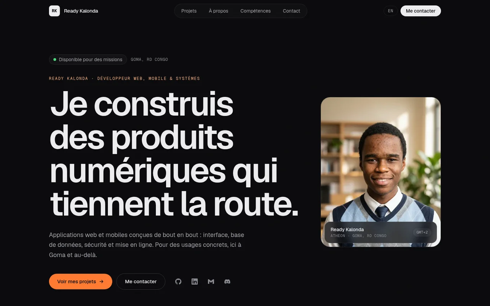
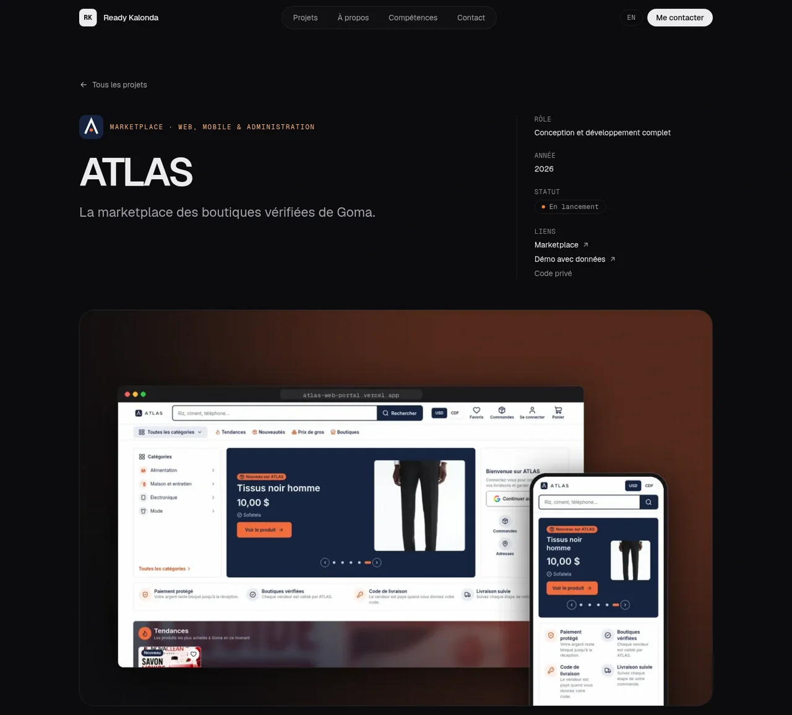
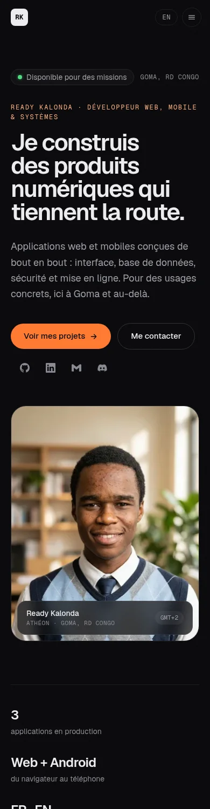

# Ready Kalonda (Athéon) — Portfolio

Développeur web, mobile et systèmes à Goma (RD Congo). Ce dépôt contient le code de mon portfolio.

**Site : [readykalonda.vercel.app](https://readykalonda.vercel.app)** · français et anglais



## Projets présentés

| Projet | Description | En ligne | Code |
| --- | --- | --- | --- |
| **ATLAS** | Marketplace des boutiques vérifiées de Goma : paiement bloqué jusqu'à la livraison, app Flutter, espace d'administration | [Marketplace](https://atlas-web-portal.vercel.app) · [Démo](https://atlas-web-psi-pied.vercel.app) | Privé |
| **ParentEcole** | Suivi scolaire entre l'école et les parents : app Android et web, site de gestion de l'école. Rôle : CTO | [Parents](https://parentecole.web.app) · [École](https://parentecole-app.web.app) | [ecoleparent](https://github.com/atheon006/ecoleparent) |
| **XERA1** | Plateforme où les créateurs documentent leur progression pour attirer collaborateurs et investisseurs. Rôle : CTO | [xera1.xyz](https://xera1.xyz) | [GIBRILmadak/XERA1](https://github.com/GIBRILmadak/XERA1) |
| **EduTrack** | Gestion scolaire multiplateforme en Flutter (Android et PWA) | [copa-ecole.web.app](https://copa-ecole.web.app) | [EduTrack-2.2](https://github.com/atheon006/EduTrack-2.2) |
| Objets perdus | Étiquettes QR pour retrouver ses objets perdus. Rôle : cofondateur | [objetsperdus.online](https://objetsperdus.online) | — |
| Portfolio v1 | Première version de ce portfolio (Vite, GSAP) | [portfolioready.vercel.app](https://portfolioready.vercel.app) | [portfolio-Ready-du-copa](https://github.com/atheon006/portfolio-Ready-du-copa) |
| ARENA | Prototype Angular connecté à l'API Gemini | — | [ARENA-V3](https://github.com/atheon006/ARENA-V3) |
| Shinobi no Sato | Quiz et duels pour fans d'anime (React, Firebase, Gemini) | — | Privé |

Les visuels des projets sont de vraies captures des sites en ligne.

### Open source : projets repris ou utilisés

| Projet | Origine | Ce que j'en ai fait |
| --- | --- | --- |
| Arcane-Ops | [apexinfinity243/Arcane-Ops](https://github.com/apexinfinity243/Arcane-Ops) | Compilation Android, Firebase, notifications, intégration continue |
| serpantinum | [ilyamiro/serpantinum](https://github.com/ilyamiro/serpantinum) | Environnement de bureau que j'utilise sous Linux |
| Midnight-Disk-Jocky | [lostlight-commits/Midnight-Disk-Jocky](https://github.com/lostlight-commits/Midnight-Disk-Jocky) | Bot musical Discord auto-hébergé |

<p>
  
  &nbsp;
  
</p>

## Le site

- **Astro** : pages statiques, aucun JavaScript inutile, images optimisées automatiquement (AVIF/WebP, tailles adaptées).
- **Tailwind CSS 4**, polices **Geist** et **Geist Mono**, thème sombre.
- **Bilingue FR/EN** : chaque texte existe dans les deux langues. La langue suit celle du navigateur, et le choix est mémorisé.
- **Une page par projet** : contexte, points forts, technologies et captures.
- **Accessible** : navigation au clavier, contrastes vérifiés, animations désactivées si le système le demande.
- **Référencement** : balises Open Graph, image de partage, données structurées, plan du site généré.

## Structure

```
src/
  data/          contenu du site : profil, projets, compétences, libellés FR/EN
  components/    sections de la page (Hero, Work, About, Stack, Contact…)
  layouts/       gabarit commun (balises, langue, animations)
  pages/         accueil, page de chaque projet, 404, sitemap.xml
  assets/        portrait, visuels des projets, icônes des technologies
public/          icônes du site, image de partage, robots.txt
```

Pour ajouter ou modifier un projet, il suffit d'éditer `src/data/projects.ts`.

## Lancer en local

```bash
npm install
npm run dev       # http://localhost:4321
npm run build     # site statique dans dist/
npm run check     # vérification des types
```

Le site est déployé sur Vercel à chaque push sur `main`.

## Crédits

- Ce dépôt est parti du modèle de portfolio de [ChiragChrg](https://github.com/ChiragChrg/Portfolio) (licence MIT), entièrement redessiné et réécrit depuis.
- Icônes des technologies : [Simple Icons](https://simpleicons.org) (CC0).

Licence MIT, voir [LICENSE](LICENSE).
